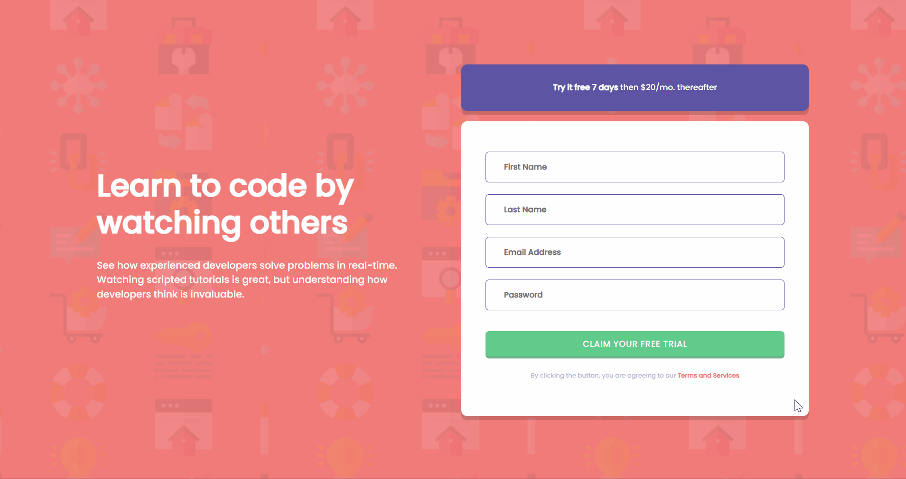

<h1>Intro component widh sing-up form - Frontend Mentor</h1>

This is a responsive introdutory component with a sing-up form. I coded this for HTML, CSS and JS practicing, as a response to <a href="https://www.frontendmentor.io/challenges/intro-component-with-signup-form-5cf91bd49edda32581d28fd1">this Frontend Mentor challenge</a> - design provided by the challenge.

<h2>Overview</h2>

<h3>The project</h3>

The aim of the exercise was to code the component as close as possible to the provided design and include form validation. Users should be able to view the optimal layout depending on their device's screen size, see hover states for the interactive elements and receive an error message when the form is submitted if any input field is empty and/or the email address is not formatted correctly.

<h3>Preview</h3>
<h4>Desktop</h4>

<h4>Tablet</h4>

<h4>Mobile</h4>

<h3>Link</h3>
<ul>
    <li>Live site URL: <a href="https://julianastahelin.github.io/component-with-sing-up-form/">https://julianastahelin.github.io/component-with-sing-up-form/</a></li>
    <li>Frontend Mentor - challenge: <a href="https://www.frontendmentor.io/challenges/intro-component-with-signup-form-5cf91bd49edda32581d28fd1">https://www.frontendmentor.io/challenges/intro-component-with-signup-form-5cf91bd49edda32581d28fd1</a></li>

</ul>

<h2>My process</h2>

<h3>Built with 👩🏽‍💻</h3>
<ul>
    <li>HTML 5;</li>
    <li>CSS 3;</li>
    <li>Bootstrap 5.3</li>
    <li>JS.</li>
</ul>

<h3>What I practiced 💪🏽</h3>
<ul>
    <li>JS form validation</li>
    <li>Formatting layout with Bootstrap;</li>
    <li>Using JS forEach loop and eventListeners.</li>
</ul> 